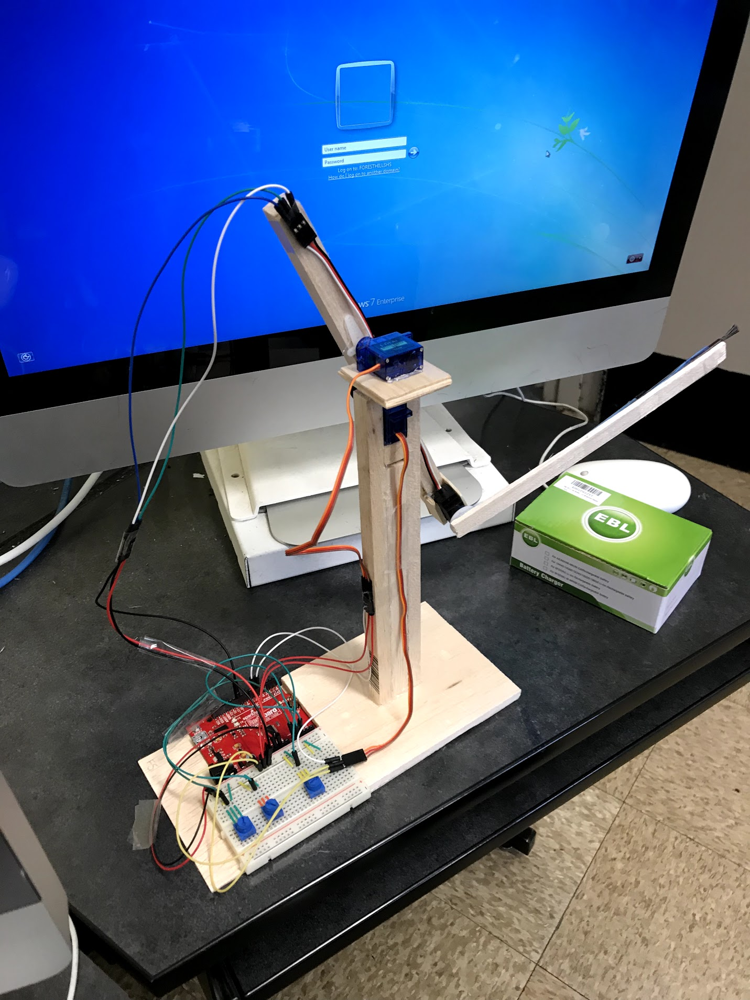

# Arduino-Robotic-Servo-Arm

The objective of this project was to develop a robotic arm that is able to lift a paintbrush and paint on a board. This arm used the Arduino platform to code and wire all the components. Using 3 potentiometers, 3 servos, and wood, this was able to reach all the desired locations to paint the goal.

## Video Walkthrough 

Here's a walkthrough of implemented user stories:

GIF created with [LiceCap](http://www.cockos.com/licecap/).
